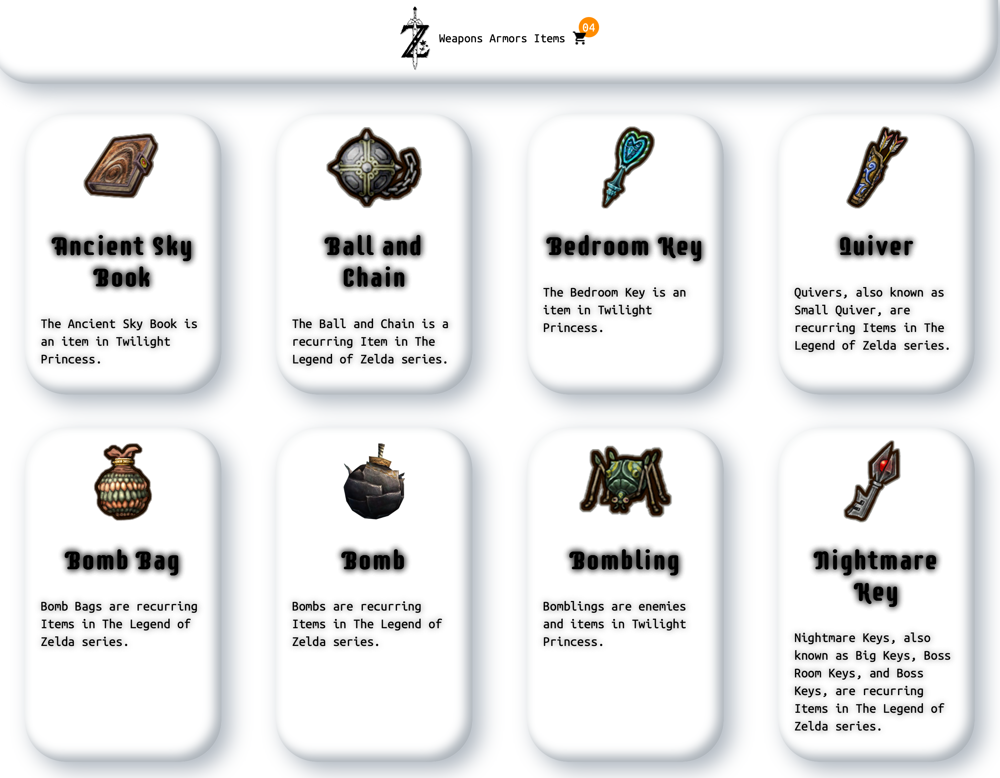

# Aboute me
My name is Dennis Deuling and I'm a certified marketing manager and web developer. But it was in my day-to-day work at my last marketing agency that I discovered my passion and love for writing code. At the agency we developed a lot of websites and I was always fascinated by the work of the developers. After the website went into production, I developed and implemented the strategy to analyse the user journey with Google Analytics and to push the data to other tools like Google Ads, Facebook, TikTok and so on. I was also asked by the other marketing project managers to better understand the journey or the solution I'd implemented or my suggestions for their own solution for the individual project. Then I decided to get more involved in technology and I love the job and it's the best I've ever done. I also have to say that getting certified was the hardest thing I've ever done because I did it while working full time. But I did it and I love my job and the code I produce. I'm also in love with all the technology I've learned so far and I love learning more.

## My technology stack

	<code></code>
	<code></code>
	<code></code>
         
	<code></code>
	<code></code>
	<code></code>
	<code></code>
	<code></code>
           
	<code></code>
	<code></code>
	<code></code>
	<code></code>
	<code></code>
         
	<code></code>
	<code></code>
	<code></code>
	<code></code>
	<code></code>
	<code></code>
	<code></code>
	<code></code>
	<code></code>
	<code></code>
         
	<code></code>
	<code></code>
	<code></code>
         
	<code></code>
	<code></code>
	<code></code>
	<code></code>
	<code></code>
	<code></code>
	<code></code>
         
	<code></code>
	<code></code>
	<code></code>

## Some of my example work
### The Zelda Store
 

**Technology**
- Gatsby
- React 
- Ecommerce.js with GraphQL API
- Stripe 
- Styled Components
 

[The Zelda Store](https://zelda-shop.netlify.app)  
[Repository](https://github.com/dennisdeuling/gatsby-ecommercejs) 

# Personal Information
- **Name:** Dennis Deuling
- **Location:** Berlin Germany
- **Languages:** German, German - Berlin Slang, English
- **Hobbies:** Gym, Anime, Cooking, Automation, Mangas, Cyber Security
- **Fun Fact about me**: I love to go to the dentist but I hate to go to the barber
